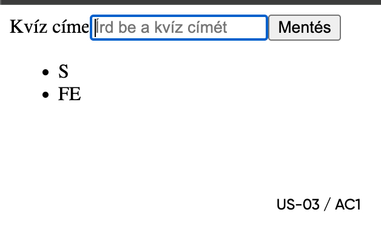
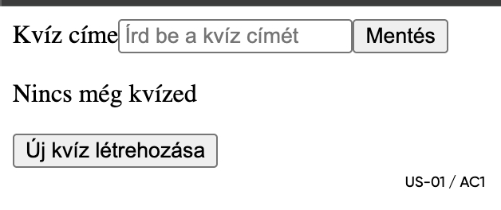
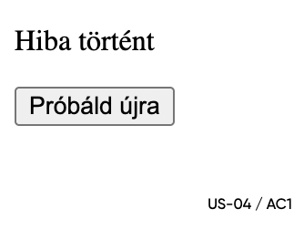
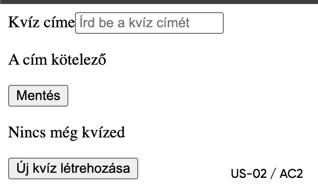

# Sprint 2 – Mentora quiz MVP szelet

> Történeti sprintzáró dokumentum. A jelenlegi prototípus már PostgreSQL backendet, adaptív kvízt, PDF/DOCX AI-generálást és Playwright E2E-teszteket is tartalmaz; az aktuális állapotot a gyökér `README.md` és a `docs/prototype` dokumentumai írják le.

## Összefoglaló

Ez a sprint egy egyszerű kvíz MVP szeletet valósít meg:

- üres állapot („Nincs még kvízed”),
- új kvíz létrehozása (valid/invalid input),
- lista nézet meglévő kvízekkel,
- hibaállapot (API hiba esetén „Hiba történt” + „Próbáld újra”).

A sprinthez tartozik Spec v0.2, user story + AC, ADR-ek, wireframe-ek, Terraform plan, AI-napló, tesztek coverage-szel és scriptelt smoke teszt.

---

## Fő deliverable-ok

- Spec v0.2:  
  [`docs/specs/product_spec_v0.2.md`](docs/specs/product_spec_v0.2.md)
- User Story + AC:  
  [`docs/stories/user_stories.md`](docs/stories/user_stories.md)
- ADR-ek:
  - Deployment target: [`docs/adr/0002-deployment-target.md`](docs/adr/0002-deployment-target.md)
  - IaC stratégia: [`docs/adr/0003-iac-strategy.md`](docs/adr/0003-iac-strategy.md)
- Wireframe-ek:  
  képek: `wireframes/*.jpg`
  leírás: [`wireframes/README.md`](wireframes/README.md)
- Traceability tábla:  
  [`docs/traceability.md`](docs/traceability.md)
- DoR / DoD:  
  [`docs/process/dor_dod.md`](docs/process/dor_dod.md)
- AI-napló:  
  [`ai/ai_log.jsonl`](ai/ai_log.jsonl)
- Terraform (IaC):  
  [`infra/terraform/`](infra/terraform)

---

## Futtatás / ellenőrzés

### Node / app

```bash
npm ci
npm run test:frontend:ci  # Vitest + JUnit + coverage
npm run build             # Vite build -> apps/frontend/dist/
npm run preview      # http://localhost:4173
```

## Smoke teszt:
- YAML alapú smoke specifikáció:
  [`scripts/smoke.yaml`](scripts/smoke.yaml)

- HTTP (REST Client) smoke:
  [`scripts/smoke.http`](scripts/smoke.http)

- Elvárás:

  GET / → HTTP 200
  a HTML tartalom tartalmazza a <div id="root"></div> snippetet (index oldal sikeres betöltése).

## Terraform (IaC):

```bash
cd docs/sprint-02/infra/terraform
terraform init
terraform validate
terraform plan -out=plan.out
```
- Artefakt:

  [Plan kimenet](infra/terraform/plan.out)

## Jelentések / artefaktok

- JUnit tesztriport:
  [`reports/junit.xml`](reports/junit.xml)

  → az aktuális riport 5, a futó offline funkciókat ellenőrző frontend unit tesztet tartalmaz, 0 hibával.

- Coverage riport (Cobertura XML):
  [`reports/coverage.xml`](reports/coverage.xml)

  → line-rate ≈ 0.92 (≈92% line coverage az offline kvíz- és Flashcards-logikán).


## A Sprint 2 lezárásakor ismert korlátok

A kvízek ekkor még in-memory tárolóban voltak; ezt a jelenlegi verzió PostgreSQL perzisztenciára cserélte.

A UI ekkor még minimális volt; a jelenlegi verzió külön dashboardokat, témákat, Flashcards és gamification nézeteket tartalmaz.

A coverage az offline kvíz- és Flashcards-logikára koncentrál; a React komponensekre nincs külön unit/komponens teszt.


## Next steps (jövőbeli fejlesztés):

Valódi backend/API integráció és perzisztens adattárolás a kvízekhez.

További komponens tesztek a UI rétegre (CreateQuizForm, QuizList, megosztási és hibaállapotok).

Alap design/styling és reszponzív nézetek bevezetése.

Az E2E kvíz-flow az aktuális verzióban Playwrighttal elkészült.

### Fő flow – lista nézet


### Üres állapot


### Hibaállapot


### Form validáció

